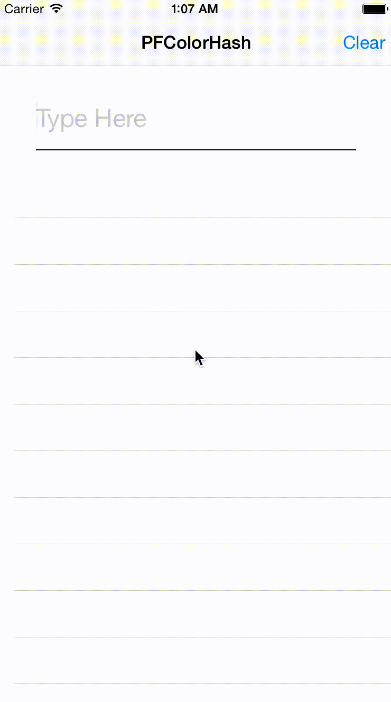

# PFColorHash

[](http://cocoapods.org/?q=PFColorHash)

**Swift 4.0 SUPPORT!**

Generate color based on the given string. Thanks to [color-hash](https://github.com/zenozeng/color-hash).



## Usage

### Basic

```Swift
let colorHash = PFColorHash()

// in HSL, Hue ∈ [0, 360), Saturation ∈ [0, 1], Lightness ∈ [0, 1]
colorHash.hsl('Hello World') // [ 225, 0.65, 0.35 ]

// in RGB, R, G, B ∈ [0, 255]
colorHash.rgb('Hello World') // [ 134, 150, 196 ]

// in HEX
colorHash.hex('Hello World') // '#8696c4'
```

### Custom Hash Function / Lightness / Saturation

```Swift
let colorHash = PFColorHash(hash: { (str: String) -> Int64 in
	var hashValue: Int64 = 0
	// Your Hash Function Here
	return hashValue
})
```

```Swift
let colorHash = PFColorHash(lightness: [0.35, 0.5, 0.65])
```

```Swift
let colorHash = PFColorHash(saturation: [0.35, 0.5, 0.65])
```

```Swift
let colorHash = PFColorHash(lightness: [0.35, 0.5, 0.65], saturation: [0.35, 0.5, 0.65])
```

## License

Released under the MIT License.